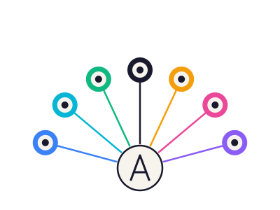

<div align="center">



# Amalgame

A self-hosted programming language that compiles to C.

[](https://github.com/amalgame-lang/Amalgame/actions/workflows/ci.yml)
[](src/)
[](tests/)
[](LICENSE)
[]()

</div>

> Site officiel : **[amalgame.me](https://amalgame.me)**
> [Tour du langage](https://amalgame.me/fr/tour) · [Installer](https://amalgame.me/fr/install) · [Versions](https://amalgame.me/fr/releases)

```kotlin
namespace App
import Amalgame.IO

public class Greeter {
    public Name: string

    public Greeter(string name) {
        this.Name = name
    }

    public string Hello() {
        guard String.Length(this.Name) > 0 else { return "Hello, stranger!" }
        return "Hello, {this.Name}!"
    }
}
```

## Overview

Amalgame is a small, statically-typed language whose compiler (`amc`)
is written in Amalgame and emits portable C. The runtime is a thin
header-only layer over libc, libgc (Boehm GC) and libcurl.

- **Self-hosted.** The compiler bootstraps itself in about five
  seconds. A tracked `snapshot/amc_lib.c` (known-good portable C)
  is the cold-start entry point — one `gcc` invocation rebuilds the
  bootstrap binary on any platform.
- **Predictable output.** Source maps cleanly to C. Strings are
  `char*`, lists are `void**` arrays, integers are `i64`. No VM, no
  hidden allocations beyond the GC. Generated C is `gcc`-buildable
  with `-O2`.
- **Multi-platform.** Linux, macOS, and Windows binaries are produced
  on every `v*` tag. Windows is supported via MinGW (Winsock under
  `#ifdef _WIN32` in the runtime).

Current version: **v0.8.3**.

## Language at a glance

```kotlin
namespace App
import Amalgame.IO

public enum Shape {
    Circle(int)
    Rect(int, int)
}

public class Program {
    public static void Main(string[] args) {
        // Match as expression with arm guards and ranges
        let n = 42
        let bucket = match n {
            0           => "zero"
            x if x < 0  => "negative"
            1..9        => "small"
            10..99      => "medium"
            _           => "large"
        }
        Console.WriteLine(bucket)

        // List comprehension
        let squares = [i * i for i in 0..10 if i % 2 == 0]
        Console.WriteLine(String.FromInt(squares.Count()))

        // Tuple destructuring
        let (q, r) = Program.DivMod(17, 5)
        Console.WriteLine("{String.FromInt(q)} rem {String.FromInt(r)}")

        // Algebraic enum + destructuring
        let s = Shape.Circle(5)
        match s {
            Circle(r)  => Console.WriteLine("r={String.FromInt(r)}")
            Rect(w, h) => Console.WriteLine("rect")
        }

        // Null-safe member access
        let maybe: Greeter? = null
        let label = maybe?.Hello()
        if (label == null) { Console.WriteLine("no greeter") }
    }

    public static (int, int) DivMod(int a, int b) {
        return (a / b, a % b)
    }
}
```

A more thorough tour is in [docs/guide/02-language-tour.md](docs/guide/02-language-tour.md).

## Getting started

### Linux

```bash
sudo apt install gcc libgc-dev libcurl4-openssl-dev
git clone https://github.com/amalgame-lang/Amalgame.git && cd Amalgame
gcc -O2 -Iruntime snapshot/amc_lib.c -lgc -lm -lcurl -o snapshot/amc
./build_amc.sh           # builds ./amc from src/ via the snapshot
./amc --version          # amc 0.4.14
./tests/run_all_tests.sh
```

### macOS

```bash
brew install bdw-gc curl
git clone https://github.com/amalgame-lang/Amalgame.git && cd Amalgame
GC_PREFIX=$(brew --prefix bdw-gc)
CURL_PREFIX=$(brew --prefix curl)
gcc -O2 -Iruntime -I"$GC_PREFIX/include" -I"$CURL_PREFIX/include" \
    -L"$GC_PREFIX/lib" -L"$CURL_PREFIX/lib" \
    snapshot/amc_lib.c -lgc -lm -lcurl -o amc
./amc --version
```

### Windows (MSYS2 MINGW64)

```bash
pacman -S mingw-w64-x86_64-gcc mingw-w64-x86_64-gc mingw-w64-x86_64-curl
git clone https://github.com/amalgame-lang/Amalgame.git && cd Amalgame
gcc -O2 -Iruntime snapshot/amc_lib.c -lgc -lm -lcurl -lws2_32 -o amc.exe
./amc.exe --version
```

### Hello, world

```kotlin
// hello.am
namespace App
import Amalgame.IO

public class Program {
    public static void Main(string[] args) {
        Console.WriteLine("Hello, Amalgame!")
    }
}
```

```bash
./amc hello.am -o hello
gcc -Iruntime hello.c -lgc -lm -lcurl -o hello
./hello
# → Hello, Amalgame!
```

## What's in the language

- Variables (`let` / `var`) with optional type annotation
- Primitives: `int`, `float`, `double`, `bool`, `string`, `void`
- Classes with inheritance, interfaces, data classes, records
- Enums (simple) and algebraic enums with destructuring
- Generics (erased to `void*` at the C level)
- Null-safety: `T?`, `??` coalescing, `?.` safe member access
- Tuples and destructuring: `let (a, b) = f()`
- Pattern matching with guards, ranges, binders, statement-shaped
  arms (`return`, `break`, `continue`)
- `match` and `if` as expressions
- List comprehensions: `[x*2 for x in xs if x > 0]`
- String interpolation: `"hello {x}"`
- Triple-quoted multiline strings: `"""…"""`
- `\xHH` and `\uHHHH` escape sequences
- Bitwise operators, compound assignments, pipeline `|>`, range `0..n`
- Guard clauses: `guard cond else { return }`
- Decorators (`@inline`, `@deprecated`) mapped to GCC attributes
- Capturing closures (since v0.3.4) — multi-param `(x,y) => …` and
  block bodies `x => { … }` since v0.3.5
- Higher-order list methods — `xs.Filter / .Map / .Reduce /
  .ForEach / .Any / .All / .CountIf` (since v0.3.6, takes a lambda)
- Generic interfaces with static contract verification
  (`class Box implements IComparable<int>`, since v0.3.5)

Detailed reference: [docs/guide/](docs/guide/).

## Diagnostics

Resolver and type-checker errors come with a source snippet and a
caret pointing at the offending token:

```
error[typechecker]: Cannot assign 'string' to 'n' of type 'int'
  --> /tmp/test.am:19:13
   |
19 |         let n: int = p.Name
   |             ^
```

```
error[resolver]: Unknown symbol 'someUndefinedThing'
  --> file.am:4:9
   |
 4 |         someUndefinedThing.x()
   |         ^
```

## Tooling

- **`amc fmt`** — formatter that re-emits a parsed AST canonically
  while preserving comments. Idempotent on every source in this
  repository. Run it as `amc fmt file.am` (stdout) or
  `amc fmt -w file.am` (rewrite in place).
- **`amc --lint file.am`** — static analysis: unreachable code,
  unused locals (prefix `_` to silence), and shadowed names.
  Warnings are non-fatal and don't bump the exit code.
- **`amc test [<dir>]`** — discovers `*_test.am` under `<dir>`
  (default `.`), compiles + runs each, and aggregates `[PASS]`,
  `[FAIL]`, `[SKIP]` lines from their stdout. Each test file is a
  normal Amalgame program with a `Main` that prints tag lines per
  case; no framework required. Exits non-zero if any case FAILs
  or any file fails to compile.
- **`amc lsp`** — workspace-aware language server speaking JSON-RPC
  2.0 on stdio. Publishes diagnostics on `didOpen` / `didChange`,
  serves `textDocument/hover` (Markdown tooltip with the inferred
  type) and `textDocument/completion` (every global symbol the
  resolver knows about, including types declared in any sibling
  `.am` file under the workspace root).
- **`amc dap`** (v0.8.0+) — Debug Adapter Protocol proxy. Detects
  a DAP-native backend on the host (`lldb-dap` from LLVM 18+,
  `gdb --dap` from gdb 14+) and `execvp()`s into it. Combined
  with `amc build -g` and the cgen's `#line` directives,
  breakpoints set on `.am` source files resolve natively via
  DWARF — no source-map files, no path translation. Works in
  VS Code (the bundled extension declares the `amc` debug
  type), Neovim, Helix, or any DAP-aware editor.
- **`amc migrate <file|dir>`** — LLM-assisted source-to-Amalgame
  migration. Auto-detects 21 source languages by extension
  (TS, Python, Java, C#, Go, Rust, …). Provider auto-selection from
  env: `ANTHROPIC_API_KEY` → claude-api, `OPENAI_API_KEY` → chatgpt,
  `GEMINI_API_KEY` → gemini, fallback `claude` (CLI). Directory
  recursion, result cache by SHA-256 of source + system prompt,
  cost estimation in `--dry-run`, automated `amc --check`
  validation. See [`docs/guide/08-llm-commands.md`](docs/guide/08-llm-commands.md).
- **`amc generate "<prompt>"`** — LLM-driven prose-to-Amalgame.
  Same provider stack, plus `--stream` via the claude CLI for
  direct stdout passthrough. Ideal for "scaffold me a starting
  point".
- **`amc explain <file.am>`** — reverse direction: emit a
  natural-language explanation of an Amalgame source file. Use
  `--lang French` (or any other) to translate the explanation.
- **VS Code syntax highlighting + LSP client** in [editors/vscode/](editors/vscode/).
  Install with:
  ```bash
  ln -s "$(pwd)/editors/vscode" ~/.vscode/extensions/amalgame-0.2.0
  ```

## Project layout

```
src/                  Compiler, written in Amalgame
├── lexer/              token.am, lexer.am
├── parser/             ast.am, parser.am
├── resolver/           symbol.am, resolver.am
├── generator/          c_gen.am, gen_test.am
├── formatter/          formatter.am
├── linter.am           static analysis (amc --lint)
├── typechecker.am
├── diagnostics.am
├── lsp.am              workspace-aware LSP server (amc lsp)
├── migrate.am          LLM source-to-Amalgame (amc migrate)
├── generate.am         LLM prose-to-Amalgame (amc generate)
├── explain.am          LLM Amalgame-to-prose (amc explain)
├── main.am             CLI: compile | fmt | test | lsp | migrate | generate | explain
└── amc_lib.c           Self-hosted bundle (generated)

runtime/              C runtime (bdwgc, strings, IO, collections, net, env, process)
stdlib/               Stdlib API reference (.am declarations)
snapshot/             Tracked amc_lib.c known-good bootstrap
tools/                save-snapshot.sh, release.sh
tests/                Sample programs + run_*.sh runners
docs/guide/           User guide chapters 1–8
docs/proposals/       Design RFCs (amc-migrate.md tracks LLM roadmap)
editors/vscode/       Syntax highlighting extension
.github/workflows/    CI + tag-driven Release automation
```

The build pipeline:

```
src/*.am ─[ ./amc ]─▶ amc_lib.c ─[ gcc ]─▶ amc binary
              ▲                              │
              └──────────────────────────────┘
                  five-second self-rebuild
```

When `./amc` is missing or broken, `build_amc.sh` falls back to
`./snapshot/amc`. From a clean clone, rebuild that binary with
`gcc snapshot/amc_lib.c …` (see `snapshot/INFO.md`). See
`tools/save-snapshot.sh` for capturing a new snapshot.

## Roadmap

The full board is in [ROADMAP_COMPLET.md](ROADMAP_COMPLET.md). The
short version, ordered by unlocked-value per day of work:

1. **Fix the SKIPped samples** — `Type.Variant` patterns in match,
   `try / catch`, null-safety inference.
2. **Minimal LSP** — completion + hover via stdio JSON-RPC, reusing
   the existing parser, resolver, and type-checker.
3. **Capturing closures.**
4. **Generic type inference.**

## Contributing

Workflow is a simplified gitflow:

- `main` carries release tags only.
- `develop` is the integration branch; PRs target it.
- Features land via `feature/<name>` branches.

```bash
git checkout develop
git checkout -b feature/my-thing
# ...
./build_amc.sh && ./tests/run_all_tests.sh
git push -u origin feature/my-thing
gh pr create --base develop
```

CI runs on every push and pull request. Releases are produced by
pushing a `v*` tag — see `.github/workflows/release.yml`.

## License

[Apache License 2.0](LICENSE) © Bastien Mouget
