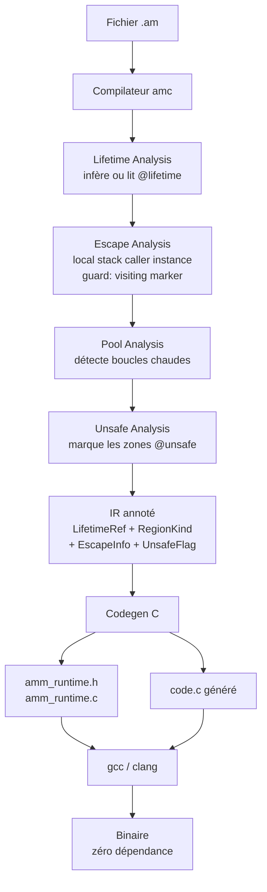
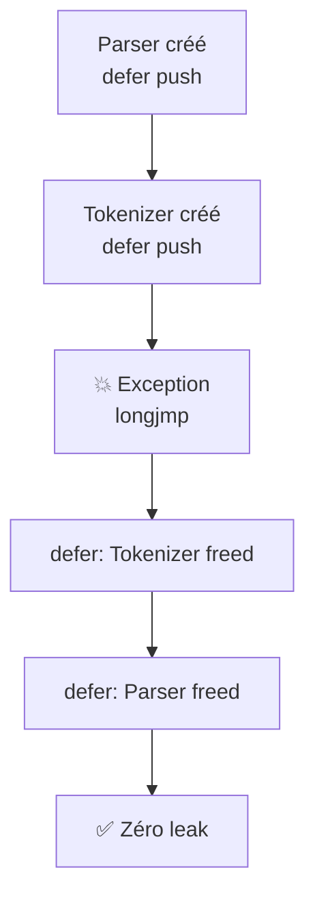

# AMM — Génération de code C
## Guide pour amc v0.4

> Ce document décrit exactement ce que `amc` doit émettre en C pour chaque construction Amalgame en mode AMM.

---

## 1. Architecture du compilateur



---

## 2. Runtime AMM

```c
/* amm_runtime.h — généré par amc, ne pas éditer */

/* ── Région de base ── */
typedef struct Region {
    char*          base;
    size_t         offset;
    size_t         capacity;
    struct Region* parent;
} Region;

Region* region_new(Region* parent);
Region* region_new_sized(Region* parent, size_t capacity);
void*   region_alloc(Region* r, size_t size);
void    region_reset(Region* r);
void    region_free(Region* r);

/* ── Pool de régions ── */
typedef struct RegionPool {
    Region** slots;
    int      count;
    int      capacity;
} RegionPool;

RegionPool* pool_new(int slots, size_t region_capacity);
Region*     pool_borrow(RegionPool* p);
void        pool_return(RegionPool* p, Region* r);

/* ── Defer stack pour unwinding ── */
typedef void (*DeferFn)(void* ctx);

typedef struct DeferStack {
    DeferFn fns[64];
    void*   ctxs[64];
    int     top;
} DeferStack;

void defer_push(DeferStack* ds, DeferFn fn, void* ctx);
void defer_run(DeferStack* ds);   /* exécute tous les defers en ordre inverse */

/* ── Shared / Ref-count ── */
typedef struct SharedHeader {
    int     ref_count;
    Region* region;
} SharedHeader;

void shared_retain(void* ptr);
void shared_release(void* ptr);

/* ── Weak references ── */
typedef struct WeakRef {
    void** target;
} WeakRef;

WeakRef weak_ref(void** target);
void*   weak_deref(WeakRef ref);

/* ── Lifetime conditionnel (lambda) ── */
typedef int (*LifetimeFn)(void* ctx);

typedef struct ConditionalRegion {
    Region*    region;
    LifetimeFn condition;
    void*      ctx;
} ConditionalRegion;

ConditionalRegion* cregion_new(Region* parent, LifetimeFn fn, void* ctx);
void               cregion_eval(ConditionalRegion* cr);
```

---

## 3. Lifetime automatique — les cinq cas

### Cas 1 : primitif → stack C

```amalgame
fn bar() {
    let x = 42
    let y = x + 1
}
```

```c
void bar(Region* _r) {
    int x = 42;
    int y = x + 1;
    /* zéro alloc heap */
}
```

### Cas 2 : tableau taille fixe → stack C

```amalgame
let arr = int[1024]
```

```c
int arr[1024];   /* stack — zéro alloc heap */
```

### Cas 3 : tableau taille dynamique → région courante

```amalgame
let arr = int[n]
```

```c
int* arr = (int*) region_alloc(_r, n * sizeof(int));
```

### Cas 4 : objet local → région locale + defer

```amalgame
fn bar() {
    let p = Point(3, 4)
    print(p.x)
}
```

```c
void bar(Region* _r) {
    DeferStack _ds = {0};
    Region* _local = region_new(_r);
    defer_push(&_ds, (DeferFn)region_free, _local);  /* defer automatique */

    Point* p = Point_new(_local, 3, 4);
    print_int(p->x);

    defer_run(&_ds);  /* region_free(_local) — même en cas d'exception */
}
```

### Cas 5 : objet retourné → région appelant, zéro copie

```amalgame
fn createUser(name: string) -> User {
    return User(name)
}
```

```c
User* createUser(Region* _caller_region, String* name) {
    /* escape analysis → _caller_region directement */
    return User_new(_caller_region, name);
}
```

---

## 4. Pool automatique — boucles chaudes

```amalgame
for item in bigList {
    let r = process(item)
    output.add(r)
}
```

```c
RegionPool* _pool = pool_new(4, 64 * 1024);

for (int i = 0; i < bigList->length; i++) {
    Region* _r = pool_borrow(_pool);        /* O(1) */
    Result* r  = process(_r, bigList->items[i]);
    List_add(output, r);
    pool_return(_pool, _r);                 /* reset O(1) */
}
```

---

## 5. Lifetimes prédéfinis

```c
/* Singletons globaux émis dans main.c */
Region* _region_static;
Region* _region_app;
Region* _region_session;
Region* _region_request;

/* @lifetime(.session) → alloué dans _region_session */
UserContext* userCtx = UserContext_new(_region_session, user);

/* API de cycle de vie */
void session_begin() { region_reset(_region_session); }
void session_end()   { region_reset(_region_session); }
```

---

## 6. Lifetime lambda

```amalgame
@lifetime(() => request.isComplete())
let cache = RequestCache()
```

```c
/* Lambda lifté en fonction C statique */
typedef struct { Request* request; } _Lambda0_ctx;

static int _lambda0(void* ctx) {
    _Lambda0_ctx* c = (_Lambda0_ctx*) ctx;
    return Request_isComplete(c->request);
}

/* Création */
_Lambda0_ctx _ctx0 = { .request = request };
ConditionalRegion* _cr0 = cregion_new(_r, _lambda0, &_ctx0);
RequestCache* cache = RequestCache_new(_cr0->region);

/* En fin de chaque scope contenant cache */
cregion_eval(_cr0);
```

---

## 7. Unwinding — Defer automatique

```amalgame
fn riskyOp() throws -> Result {
    let a = Parser()
    let b = Tokenizer()
    let c = dangerousCall()
    return Result(b)
}
```

```c
Result* riskyOp(Region* _caller_region) {
    DeferStack _ds = {0};

    Region* _ra = region_new(_caller_region);
    defer_push(&_ds, (DeferFn)region_free, _ra);

    Parser* a = Parser_new(_ra);

    Region* _rb = region_new(_caller_region);
    defer_push(&_ds, (DeferFn)region_free, _rb);

    Tokenizer* b = Tokenizer_new(_rb);

    /* dangerousCall peut throw — les defers s'exécutent via setjmp/longjmp */
    if (setjmp(_amm_jmp) != 0) {
        defer_run(&_ds);   /* _rb freed, puis _ra freed */
        amm_rethrow();
    }

    void* c = dangerousCall(_caller_region);

    Result* result = Result_new(_caller_region, b);
    defer_run(&_ds);
    return result;
}
```



---

## 8. Generics

```amalgame
public class Container<T> {
    public item: T
}

let c1 = Container<Parser>()           // T hérite
let c2 = Container<shared User>()      // T indépendant
let c3 = Container<@lifetime(.app) Config>()  // T explicite
```

```c
/* amc génère une spécialisation par type T effectif */

/* Container<Parser> — T dans région de Container */
typedef struct {
    Region*  _region;
    Parser*  item;
} Container_Parser;

/* Container<shared User> — T avec SharedHeader propre */
typedef struct {
    Region*  _region;
    User*    item;   /* shared_retain/release géré séparément */
} Container_SharedUser;

/* Container<@lifetime(.app) Config> — T dans _region_app */
typedef struct {
    Region*  _region;
    Config*  item;   /* alloué dans _region_app */
} Container_AppConfig;
```

---

## 9. FFI — Unsafe

```amalgame
@unsafe {
    let raw = malloc(512)
    let buf = Buffer.fromPtr(raw, 512)
}
```

```c
/* @unsafe → pas de Region*, pas de defer, pas de checks AMM */
{
    void* raw = malloc(512);              /* C pur */
    Buffer* buf = Buffer_from_ptr(raw, 512, _r);  /* conversion → AMM */
    /* buf est maintenant dans la région AMM _r */
}
```

---

## 10. Récursion mutuelle — garde escape analysis

```c
/* Dans amc — algorithme escape analysis */
typedef enum { NOT_VISITED, VISITING, VISITED } VisitState;

VisitState fn_state[MAX_FUNCTIONS] = {0};

EscapeInfo analyze_escapes(FunctionRef fn) {
    if (fn_state[fn] == VISITING) {
        return ESCAPES_TRUE;   /* cycle détecté → sûr par défaut */
    }
    fn_state[fn] = VISITING;
    EscapeInfo result = _analyze_escapes_impl(fn);
    fn_state[fn] = VISITED;
    return result;
}
```

---

## 11. Point d'entrée — main

```c
int main(int argc, char** argv) {
    /* Régions prédéfinies */
    _region_static  = region_new(NULL);
    _region_app     = region_new(_region_static);
    _region_session = region_new(_region_app);
    _region_request = region_new(_region_session);

    amalgame_main(_region_app, argc, argv);

    region_free(_region_request);
    region_free(_region_session);
    region_free(_region_app);
    /* _region_static jamais freed */
    return 0;
}
```

---

## 12. Performances attendues

| Opération | malloc/free | AMM naïf | AMM + pool |
|-----------|------------|----------|-----------|
| Allocation | ~100ns | ~10ns | **~2ns** |
| Libération individuelle | ~100ns | — | — |
| Libération en masse | N × 100ns | **1 appel** | **1 reset** |
| Fragmentation | Élevée | Nulle | Nulle |

---

## 13. Checklist d'implémentation dans amc

- [ ] **Lifetime Analysis** : identifier le lifetime de chaque valeur
- [ ] **Escape Analysis** : stack / local / caller / instance / closure + garde `visiting`
- [ ] **Pool Analysis** : détecter boucles chaudes → générer `RegionPool`
- [ ] **Unsafe Analysis** : marquer les zones `@unsafe`, vérifier les fuites
- [ ] **Defer codegen** : émettre `DeferStack` + `defer_push` + `defer_run` par scope
- [ ] **Codegen régions** : `region_new` / `region_free` / `region_reset`
- [ ] **Codegen prédéfinis** : singletons `_region_xxx` + API cycle de vie
- [ ] **Codegen lambda** : lifter lambda → `LifetimeFn` + ctx struct + `cregion_eval`
- [ ] **Codegen generics** : spécialiser par type T, appliquer règle d'héritage
- [ ] **Codegen shared** : `SharedHeader` + retain/release
- [ ] **Codegen weak** : `WeakRef` + null-check obligatoire
- [ ] **Move checker** : invalider variables après move → `AMM001`
- [ ] **Double usage checker** : → `AMM002`
- [ ] **Frontière GC checker** : → `AMM003`
- [ ] **Lambda checker** : type bool + pureté → `AMM007` / `AMM008`
- [ ] **Unsafe escape checker** : → `AMM009`
- [ ] **Émettre runtime** : `amm_runtime.h` + `amm_runtime.c`
