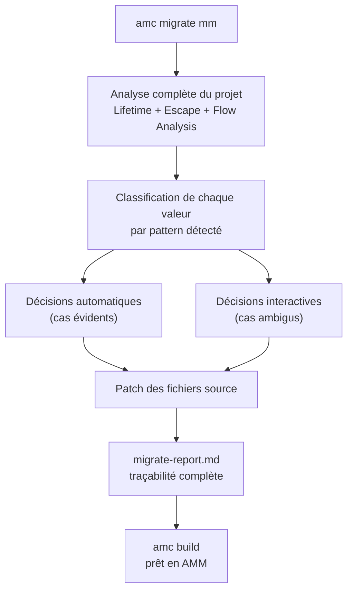
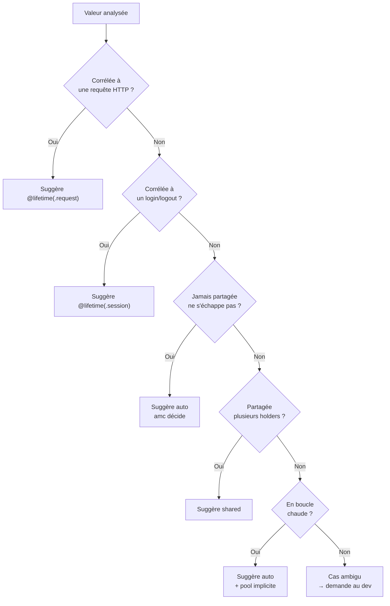

# amc migrate mm — Guide de migration GC → AMM
## v0.1

> `amc migrate mm` est un outil interactif qui analyse un projet Amalgame en mode GC et guide le dev vers AMM, décision par décision. Il réutilise le pipeline d'analyse complet d'`amc` pour faire des suggestions pertinentes.

---

## Usage

```bash
amc migrate mm              # migration interactive complète
amc migrate mm --auto       # migration automatique sans questions
amc migrate mm --report     # analyse uniquement, génère un rapport sans modifier
amc migrate mm --file Parser.am  # migration d'un seul fichier
```

---

## Architecture de la commande



---

## Patterns détectés automatiquement

`amc` analyse le graphe de flot de données et classe chaque valeur selon des patterns reconnus.



| Pattern détecté | Suggestion | Confiance |
|-----------------|-----------|-----------|
| Valeur locale, ne s'échappe pas | `auto` | ✅ Automatique |
| Valeur retournée | `auto` (escape) | ✅ Automatique |
| Valeur en boucle | `auto` + pool | ✅ Automatique |
| Primitif | Stack — rien à faire | ✅ Automatique |
| Tableau taille fixe | Stack — rien à faire | ✅ Automatique |
| Corrélée à req HTTP | `@lifetime(.request)` | 🟠 Suggérée |
| Corrélée à session | `@lifetime(.session)` | 🟠 Suggérée |
| Vit toute la durée | `@lifetime(.app)` | 🟠 Suggérée |
| Partagée | `shared` | 🟠 Suggérée |
| Cycle de référence | `shared` + `weak` | 🟠 Suggérée |
| Cas ambigu | Lambda custom | ❓ Interactif |

---

## Session interactive

```bash
$ amc migrate mm

🔍 Analyse du projet...
   47 fichiers · 3 241 valeurs · 89 fonctions

✅ 3 156 valeurs migrées automatiquement
📋 12 décisions à prendre

─────────────────────────────────────────────────────
[1/12] src/core/Parser.am — ligne 34

  let cache = RequestCache()

  💡 amc détecte : cette valeur est allouée à chaque requête
     et libérée quand la requête se termine.

  Suggestions :
  (a) @lifetime(.request)            prédéfini recommandé ⭐
  (b) @lifetime(() => condition)     lambda custom
  (c) auto                           laisser amc décider
  (d) skip                           garder en GC

  > a

  ✅ @lifetime(.request) appliqué — ligne 34
─────────────────────────────────────────────────────
[2/12] src/auth/UserContext.am — ligne 12

  let session = SessionContext(user)

  💡 amc détecte : cette valeur est créée au login
     et accédée jusqu'au logout.

  Suggestions :
  (a) @lifetime(.session)            prédéfini recommandé ⭐
  (b) @lifetime(() => condition)     lambda custom
  (c) auto                           laisser amc décider
  (d) skip                           garder en GC

  > b

  ✏️  Entrez votre condition (lambda sans paramètre, retourne bool) :
  > () => user.isLoggedOut()

  ✅ @lifetime(() => user.isLoggedOut()) appliqué — ligne 12
─────────────────────────────────────────────────────
[3/12] src/cache/SharedCache.am — ligne 8

  let store = CacheStore()

  💡 amc détecte : cette valeur est référencée depuis
     3 endroits différents (Server, Monitor, Logger).

  Suggestions :
  (a) shared                         ref-count recommandé ⭐
  (b) @lifetime(.app)                région app partagée
  (c) auto                           laisser amc décider
  (d) skip                           garder en GC

  > a

  ✅ shared appliqué — ligne 8
─────────────────────────────────────────────────────
...

✅ Migration terminée

   3 156 valeurs → lifetime automatique
   6 valeurs     → lifetimes prédéfinis
   1 valeur      → lambda custom
   2 valeurs     → shared
   3 valeurs     → gardées en GC (skip)

📄 Rapport généré : migrate-report.md
🔧 Fichiers modifiés : 8 / 47

Prochaine étape :
  amc build     → vérifier que tout compile
  amc check mm  → vérifier les garanties AMM
```

---

## Rapport généré — migrate-report.md

```markdown
# Migration AMM — Rapport
Généré le : 2024-01-15 14:32
Projet : MyApp v1.2.0

## Résumé
- 3 241 valeurs analysées
- 3 156 automatiques (97.4%)
- 12 interactives (0.4%)
- 3 gardées en GC (0.1%)

## Décisions interactives

### src/core/Parser.am:34
Valeur      : RequestCache
Pattern     : corrélée à requête HTTP
Décision    : @lifetime(.request)
Décidé par  : utilisateur

### src/auth/UserContext.am:12
Valeur      : SessionContext
Pattern     : corrélée à session utilisateur
Décision    : @lifetime(() => user.isLoggedOut())
Décidé par  : utilisateur (lambda custom)

### src/cache/SharedCache.am:8
Valeur      : CacheStore
Pattern     : partagée (3 holders)
Décision    : shared
Décidé par  : utilisateur

## Valeurs gardées en GC
- src/legacy/Formatter.am:21 — skip explicite
- src/legacy/Formatter.am:45 — skip explicite
- src/ui/Renderer.am:67      — skip explicite

## Modifier une décision
  amc migrate mm --redo src/core/Parser.am:34
```

---

## Commandes complémentaires

```bash
# Vérifier les garanties AMM après migration
amc check mm

# Rejouer une décision spécifique
amc migrate mm --redo src/core/Parser.am:34

# Annuler toute la migration
amc migrate mm --rollback

# Voir ce qui serait fait sans modifier
amc migrate mm --dry-run

# Migration non-interactive — amc choisit tout
amc migrate mm --auto
```

---

## Extensibilité — autres migrations futures

`amc migrate` est un namespace extensible. `mm` est la première sous-commande.

```bash
amc migrate mm        # GC → AMM (cette commande)
amc migrate syntax    # future : migration syntaxe entre versions
amc migrate edition   # future : migration entre éditions du langage
amc migrate imports   # future : réorganisation des namespaces
```

Chaque sous-commande suit le même pattern :
1. Analyse du projet
2. Décisions automatiques silencieuses
3. Décisions interactives pour les cas ambigus
4. Patch des fichiers source
5. Rapport de traçabilité

---

## Implémentation dans amc

### Prérequis

`amc migrate mm` nécessite que les phases suivantes soient complètes :

- ✅ Phase 0 — Lifetime Analysis
- ✅ Phase 1 — Escape Analysis
- ✅ Phase 4 — Pool Analysis
- ✅ Phase 5 — Lifetimes prédéfinis
- ✅ Phase 6 — Lifetime lambda

### Nouveaux composants

1. **Flow Analyzer** — corrèle les valeurs aux cycles de vie métier (requête, session, app)
2. **Pattern Matcher** — classe chaque valeur dans un pattern de la table ci-dessus
3. **Interactive CLI** — affiche les suggestions, lit les choix du dev
4. **Source Patcher** — applique les annotations dans les fichiers source
5. **Report Generator** — génère `migrate-report.md`
6. **Rollback System** — sauvegarde les fichiers avant modification

### Checklist

- [ ] Flow Analyzer : corréler valeurs aux patterns métier connus
- [ ] Pattern Matcher : classifier avec niveau de confiance
- [ ] CLI interactive : afficher suggestions, lire choix, valider lambda
- [ ] Source Patcher : injecter `@lifetime(...)` / `shared` dans le source
- [ ] Report Generator : émettre `migrate-report.md`
- [ ] `--auto` : appliquer la suggestion ⭐ sans interaction
- [ ] `--report` : analyser sans modifier
- [ ] `--dry-run` : afficher ce qui serait fait
- [ ] `--redo` : rejouer une décision spécifique
- [ ] `--rollback` : restaurer les fichiers originaux
- [ ] `amc check mm` : vérifier les garanties AMM post-migration
