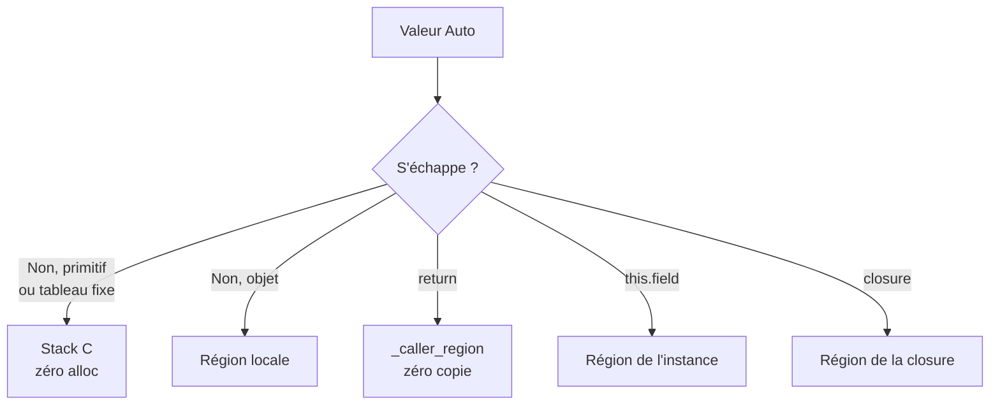
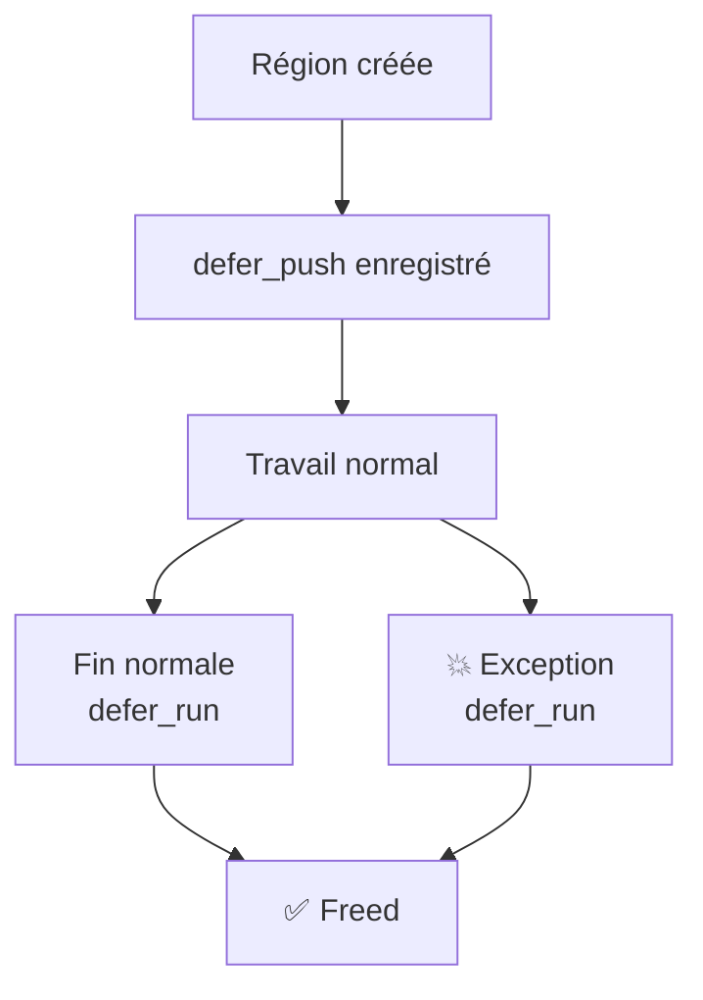
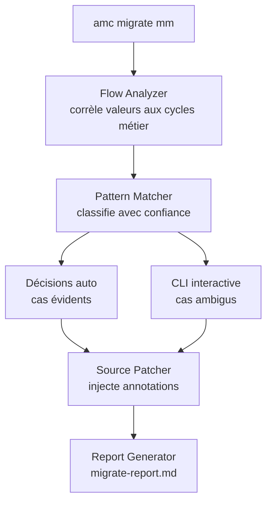
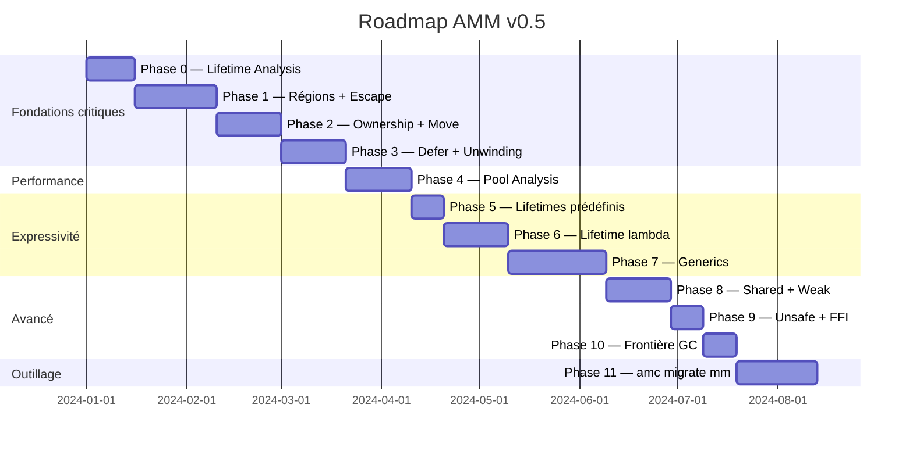

# AMM — Roadmap d'implémentation
## Dans le compilateur amc v0.5

---

## Vue d'ensemble

```mermaid
graph LR
    P0["Phase 0\nLifetime Analysis"] --> P1["Phase 1\nRégions + Escape"]
    P1 --> P2["Phase 2\nOwnership + Move"]
    P2 --> P3["Phase 3\nDefer + Unwinding"]
    P3 --> P4["Phase 4\nPool Analysis"]
    P4 --> P5["Phase 5\nLifetimes prédéfinis"]
    P5 --> P6["Phase 6\nLifetime lambda"]
    P6 --> P7["Phase 7\nGenerics"]
    P7 --> P8["Phase 8\nShared + Weak"]
    P8 --> P9["Phase 9\nUnsafe + FFI"]
    P9 --> P10["Phase 10\nFrontière GC"]
    P10 --> P11["Phase 11\namc migrate mm"]

    style P0 fill:#5a2d2d,color:#fff
    style P1 fill:#2d5a2d,color:#fff
    style P2 fill:#2d5a2d,color:#fff
    style P3 fill:#2d5a2d,color:#fff
    style P4 fill:#5a4a2d,color:#fff
    style P5 fill:#5a4a2d,color:#fff
    style P6 fill:#5a4a2d,color:#fff
    style P7 fill:#5a4a2d,color:#fff
    style P8 fill:#2d3a5a,color:#fff
    style P9 fill:#2d3a5a,color:#fff
    style P10 fill:#2d3a5a,color:#fff
    style P11 fill:#4a2d5a,color:#fff
```



| Phase | Contenu | Priorité | Effort |
|-------|---------|----------|--------|
| 0 | Lifetime Analysis — infrastructure | 🔴 Fondation | Moyen |
| 1 | Régions + Escape Analysis | 🔴 Fondation | Moyen |
| 2 | Ownership + Move checker | 🔴 Sécurité | Moyen |
| 3 | Defer + Unwinding | 🔴 Sécurité | Moyen |
| 4 | Pool Analysis | 🟠 Performance | Moyen |
| 5 | Lifetimes prédéfinis | 🟠 Ergonomie | Faible |
| 6 | Lifetime lambda | 🟠 Expressivité | Moyen |
| 7 | Generics | 🟠 Complétude | Élevé |
| 8 | Shared + Weak | 🟡 Cas avancés | Moyen |
| 9 | Unsafe + FFI | 🟡 Interop C | Faible |
| 10 | Frontière AMM/GC | 🟡 Interop GC | Faible |
| 11 | `amc migrate mm` | 🟣 Ergonomie migration | Moyen |

---

## Phase 0 — Lifetime Analysis

**Objectif :** infrastructure centrale. Toutes les phases suivantes s'appuient dessus.

### Nœud produit

```
LifetimeInfo {
    kind      : Auto | Predefined | Lambda
    predefined: Call | Request | Session | App | Static
    lambda    : FnRef
    region    : Stack | Local | Caller | Instance | Pool
}
```

### Algorithme

```
pour chaque déclaration V :
  si @lifetime(lambda) → kind = Lambda
  si @lifetime(.xxx)   → kind = Predefined
  sinon                → kind = Auto
```

### Critère de succès

Chaque nœud de l'IR porte un `LifetimeInfo` valide.

---

## Phase 1 — Régions et Escape Analysis

**Objectif :** les valeurs Auto sont placées dans la bonne région.



**Garde récursion mutuelle :**

```
fn analyze(F):
  si F.state == VISITING → retourne ESCAPES_TRUE
  F.state = VISITING
  résultat = _analyze_impl(F)
  F.state = VISITED
  retourne résultat
```

### Changements dans amc

1. IR : injecter `Region* _r` comme paramètre implicite
2. Escape Analysis pass avec marqueur `visiting`
3. Codegen : `region_new` / `region_free` selon résultat
4. Codegen : primitifs et tableaux fixes → variables C locales
5. Build : émettre `amm_runtime.h` et `amm_runtime.c`

### Critère de succès

```amalgame
fn createUser(name: string) -> User {
    return User(name)
}
// valgrind → zéro leak
// C généré → User_new(_caller_region, name)
```

---

## Phase 2 — Ownership et Move checker

**Objectif :** zéro usage après move, zéro double propriétaire.

### Changements dans amc

1. État `Live | Moved` sur chaque variable locale
2. Usage `Moved` → `AMM001`
3. Double usage sans `shared` → `AMM002`
4. Parser : reconnaître `shared`

### Critère de succès

```amalgame
let a = Buffer.new(512)
let b = a
print(a)  // → ERREUR AMM001
```

---

## Phase 3 — Defer et Unwinding

**Objectif :** zéro leak même en cas d'exception.



### Changements dans amc

1. Émettre `DeferStack _ds` en tête de chaque fonction AMM
2. Émettre `defer_push` après chaque `region_new`
3. Émettre `defer_run` avant chaque `return` et en cas d'exception
4. Implémenter `defer_push` / `defer_run` dans `amm_runtime.c`
5. Mécanisme d'exception : `setjmp` / `longjmp`

---

## Phase 4 — Pool Analysis

**Objectif :** zéro overhead dans les boucles chaudes.

### Algorithme

```
pour chaque boucle L dans le CFG :
  pour chaque appel F dans L :
    si F alloue des objets lifetime Auto + local :
      → générer RegionPool avant L
      → remplacer region_new/free par pool_borrow/return
```

### Critère de succès

```amalgame
for item in million_items {
    let r = process(item)
}
// ~2ns par itération après warmup
```

---

## Phase 5 — Lifetimes prédéfinis

**Objectif :** `@lifetime(.session)` etc. partagent la bonne région.

### Changements dans amc

1. Émettre singletons `_region_static/app/session/request/call` dans main
2. `@lifetime(.xxx)` → allouer dans `_region_xxx`
3. API `session_begin/end`, `request_begin/end` pour reset

---

## Phase 6 — Lifetime lambda

**Objectif :** `@lifetime(() => cond)` génère une `ConditionalRegion`.

### Changements dans amc

1. Parser : reconnaître `@lifetime(() => expr)`
2. Lambda lifter : transformer en `LifetimeFn` + struct captures
3. Check type bool → `AMM007`
4. Check pureté → `AMM008`
5. Codegen : `cregion_new` + `cregion_eval`

---

## Phase 7 — Generics

**Objectif :** `Container<T>` applique la règle d'héritage de lifetime.

### Règle

```
T sans annotation   → hérite région du conteneur
T = shared U        → ref-count indépendant
T = @lifetime(.x) U → région _region_x
T = primitif        → stack / copie
```

### Changements dans amc

1. Monomorphisation par type T effectif
2. Appliquer règle d'héritage à chaque spécialisation
3. Escape analysis sur `getItem<T>`

---

## Phase 8 — Shared et Weak

### Shared
1. `shared T` → type distinct
2. `SharedHeader` préfixé + retain/release automatiques
3. `ref_count = 0` → `region_free`

### Weak
1. `weak T` → uniquement sur `shared T` → sinon `AMM006`
2. `WeakRef` + mort de cible → `*target = NULL`
3. Usage sans null-check → `AMM005`

---

## Phase 9 — Unsafe et FFI

### Changements dans amc

1. Parser : reconnaître `@unsafe { }`
2. Dans `@unsafe` : désactiver tous les checks AMM
3. `@extern` → marqué unsafe implicitement
4. Fuite sans `.fromPtr()` → `AMM009`

---

## Phase 10 — Frontière AMM / GC

### Changements dans amc

1. Annoter chaque nœud `MemoryMode { AMM | GC }`
2. Passage AMM→GC sans `.copy()` → `AMM003`
3. `.copy()` → `malloc` classique hors région
4. Lire `[memory] mode` dans `amalgame.toml`
5. Parser : reconnaître `@amm` / `@gc` en tête de fichier

---

## Phase 11 — amc migrate mm

**Objectif :** outil interactif de migration GC → AMM. Réutilise le pipeline d'analyse complet des phases précédentes.



### Prérequis

Phases 0, 1, 4, 5, 6 complètes.

### Nouveaux composants

1. **Flow Analyzer** — corrèle les valeurs aux cycles de vie métier
2. **Pattern Matcher** — classe avec niveau de confiance
3. **Interactive CLI** — suggestions, choix, validation lambda
4. **Source Patcher** — injecte `@lifetime` / `shared` dans le source
5. **Report Generator** — émet `migrate-report.md`
6. **Rollback System** — sauvegarde avant modification

### Commandes

```bash
amc migrate mm              # interactif complet
amc migrate mm --auto       # automatique sans questions
amc migrate mm --report     # analyse seule, pas de modification
amc migrate mm --dry-run    # affiche sans modifier
amc migrate mm --redo file:line  # rejouer une décision
amc migrate mm --rollback   # annuler toute la migration
amc check mm                # vérifier les garanties post-migration
```

### Extensibilité

```bash
amc migrate mm        # GC → AMM
amc migrate syntax    # future : migration syntaxe
amc migrate edition   # future : migration édition
amc migrate imports   # future : réorganisation namespaces
```

### Checklist

- [ ] Flow Analyzer
- [ ] Pattern Matcher avec table de confiance
- [ ] CLI interactive
- [ ] Source Patcher
- [ ] Report Generator
- [ ] Mode `--auto`
- [ ] Mode `--report` / `--dry-run`
- [ ] Mode `--redo`
- [ ] Mode `--rollback`
- [ ] `amc check mm`

---

## Timeline


