# AMM — Amalgame Memory Model
## Spécification v0.4 (DESIGN / ROADMAP — non implémenté)

> ⚠️ **Statut : proposition de design, PAS encore implémentée.**
> AMM décrit le modèle mémoire *cible* d'Amalgame. À ce jour le
> compilateur `amc` n'implémente **aucun** de ces mécanismes
> (lifetimes inférés, régions, move semantics) : le runtime actuel
> utilise le **Boehm GC** (`runtime/_runtime.h`). AMM est planifié
> pour une version future (voir `amm-roadmap.md`). Tout ce qui suit
> est un objectif de conception, pas une fonctionnalité disponible.

> AMM *vise* à être le modèle mémoire natif d'Amalgame, reposant sur un système de **lifetimes automatiques** inférés par le compilateur, complétés par des lifetimes déclarables et des lambdas de libération pour les cas métier complexes : zéro GC, zéro annotation obligatoire, zéro dépendance externe.

---

## Tableau comparatif (objectifs de conception, non mesurés)

> ⚠️ Ce tableau compare les **objectifs visés** d'AMM aux modèles
> existants. Les colonnes AMM sont des cibles de design, pas des
> résultats mesurés sur une implémentation — celle-ci n'existe pas
> encore.

| Critère | GC classique | Vala | Go | Swift | Nim | Zig | Rust | **AMM** |
|---------|:-----------:|:----:|:--:|:-----:|:---:|:---:|:----:|:-------:|
| Pauses GC | ❌ Oui | ✅ Non | ❌ Oui | ✅ Non | ⚠️ Opt. | ✅ Non | ✅ Non | ✅ **Non** |
| Cycles mémoire | ✅ Géré | ❌ Leak | ✅ Géré | ❌ Leak | ⚠️ Opt. | ✅ Manuel | ❌ Leak `Rc` | ✅ **`weak`** |
| Overhead runtime | ❌ Élevé | ⚠️ Moyen | ❌ Élevé | ⚠️ Moyen | ⚠️ Moyen | ✅ Minimal | ✅ Minimal | ✅ **Minimal** |
| Vitesse allocation | ❌ Lente | ⚠️ Moyenne | ❌ Lente | ⚠️ Moyenne | ⚠️ Moyenne | ✅ Rapide | ⚠️ Moyenne | ✅ **Très rapide** |
| Vitesse libération | ❌ Imprévisible | ⚠️ Fréquente | ❌ Imprévisible | ⚠️ Fréquente | ⚠️ Variable | ✅ Manuel | ⚠️ Fréquente | ✅ **En masse** |
| Fragmentation | ❌ Élevée | ⚠️ Moyenne | ❌ Élevée | ⚠️ Moyenne | ⚠️ Moyenne | ✅ Faible | ⚠️ Moyenne | ✅ **Nulle** |
| Sécurité statique | ❌ Aucune | ⚠️ Partielle | ❌ Aucune | ⚠️ Partielle | ⚠️ Partielle | ⚠️ Partielle | ✅ Maximale | ✅ **Forte** |
| Lifetimes sémantiques | ❌ | ❌ | ❌ | ❌ | ❌ | ⚠️ Manuel | ⚠️ Verbeux | ✅ **Inférés + lambda** |
| Unwinding sûr | ✅ | ⚠️ | ✅ | ✅ | ⚠️ | ⚠️ Manuel | ✅ | ✅ **Defer auto** |
| Dépendance externe | ❌ Runtime | ❌ GLib | ❌ Runtime | ⚠️ stdlib | ⚠️ Opt. | ✅ Aucune | ✅ Aucune | ✅ **Aucune** |
| Ergonomie dev | ✅ Max | ✅ Bonne | ✅ Bonne | ✅ Bonne | ✅ Bonne | ⚠️ Moyenne | ❌ Difficile | ✅ **Bonne** |
| Courbe apprentissage | ✅ Faible | ✅ Faible | ✅ Faible | ✅ Faible | ✅ Faible | ⚠️ Moyenne | ❌ Élevée | ✅ **Faible** |
| Compile vers C | ❌ | ✅ | ❌ | ❌ | ✅ | ❌ | ❌ | ✅ |

> **AMM est le seul modèle à tout combiner :** zéro pause · zéro fragmentation · sécurité statique forte · lifetimes inférés ou lambda · unwinding sûr · ergonomie élevée · zéro dépendance · compile vers C.

---

## 1. Principes fondamentaux

AMM repose sur cinq invariants vérifiés **à la compilation** :

1. **Toute valeur a exactement un propriétaire** à tout instant.
2. **Toute région est libérée exactement une fois**, selon son lifetime.
3. **Aucune valeur ne peut être accédée après la mort de sa région**.
4. **Le lifetime est inféré par défaut** — le dev n'annote que les cas métier.
5. **Toute région est libérée même en cas d'exception** — via defer automatique.

---

## 2. Lifetimes

### 2.1 Le modèle central

Le concept fondateur d'AMM n'est pas la région — c'est le **lifetime**. Une région est simplement l'implémentation d'un lifetime. Le dev pense en termes de durée de vie sémantique, pas d'allocations.

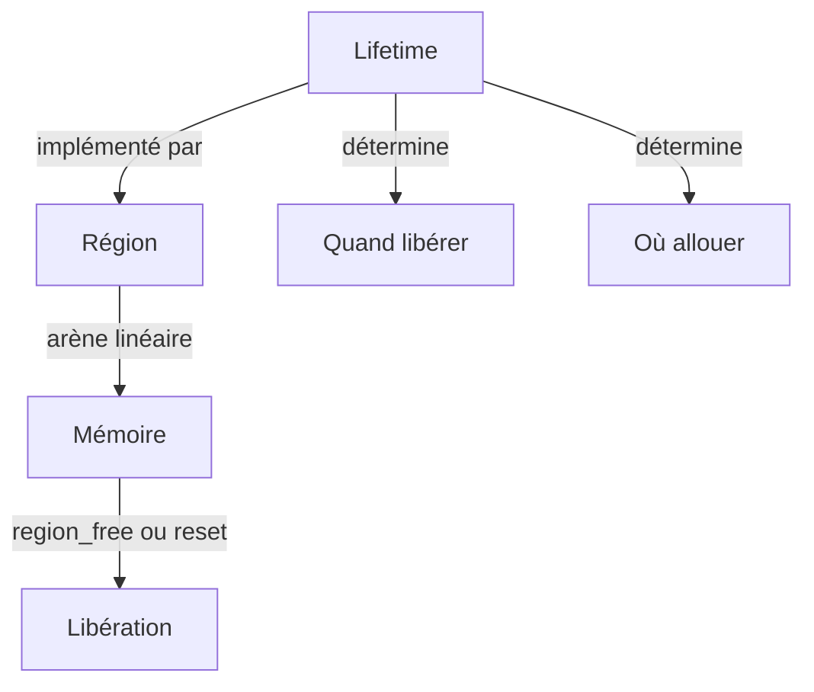

### 2.2 Les trois niveaux de lifetime

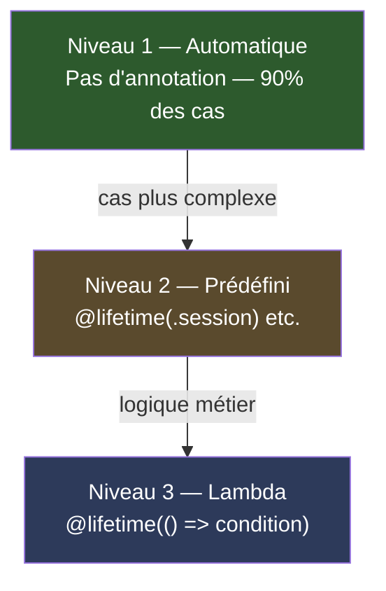

### 2.3 Niveau 1 — Lifetime automatique

Par défaut, `amc` infère le lifetime de chaque valeur via l'escape analysis.

```amalgame
fn process(data: string) -> Result {
    let parser = Parser(data)       // inféré : local, freed à la fin
    let tokens = parser.tokenize()  // inféré : local, freed à la fin
    let result = Result(tokens)     // inféré : s'échappe → région appelant
    return result
}
```

**Décisions d'allocation automatiques :**

| Pattern | Décision |
|---------|---------|
| Primitif, ne s'échappe pas | Stack C — zéro allocation |
| Tableau taille fixe `T[N]` | Stack C — zéro allocation |
| Tableau taille dynamique `T[n]` | Région courante |
| Objet, ne s'échappe pas | Région locale |
| Objet retourné | Région appelant — zéro copie |
| Objet en boucle | Pool de régions — reset O(1) |
| Objet dans champ | Région de l'instance |

### 2.4 Niveau 2 — Lifetimes prédéfinis

```amalgame
@lifetime(.call)     let parser  = Parser(data)
@lifetime(.request)  let cache   = Cache()
@lifetime(.session)  let userCtx = UserContext(user)
@lifetime(.app)      let config  = Config.load()
@lifetime(.static)   let consts  = Constants()
```

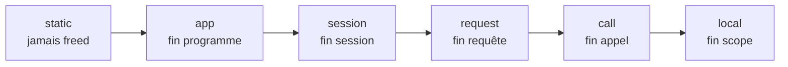

### 2.5 Niveau 3 — Lifetime lambda

```amalgame
@lifetime(() => request.isComplete())
let cache = RequestCache()

@lifetime(() => user.isLoggedOut())
let preferences = UserPreferences(user)
```

**Règles du lambda :**
- Retourne obligatoirement `bool` → sinon `AMM007`
- Évalué en fin de chaque scope contenant la valeur
- Lecture seule — pas d'effets de bord → sinon `AMM008`

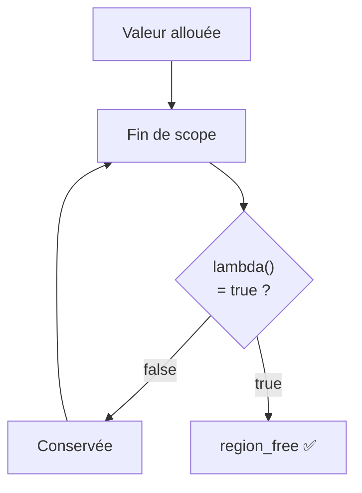

---

## 3. Régions

### 3.1 Hiérarchie

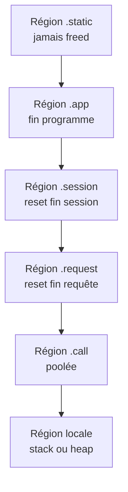

### 3.2 Pool de régions

Pour les fonctions appelées en boucle, `amc` génère automatiquement un pool. La région est **resetée** (offset = 0) et rendue au pool — pas détruite.

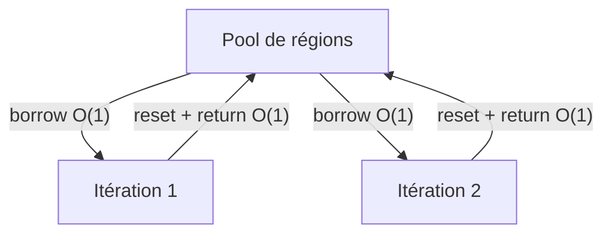

**Zéro appel système en régime de croisière.**

---

## 4. Ownership

### 4.1 Vue d'ensemble

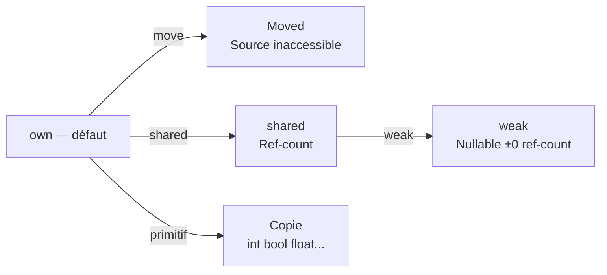

### 4.2 Move par défaut

```amalgame
let a = Buffer.new(512)
let b = a               // move — a inaccessible
print(a)                // ERREUR AMM001 : value already moved
print(b)                // OK
```

### 4.3 Shared

```amalgame
let user = shared User("Bastien")
cache.store(user)    // ref-count +1
session.attach(user) // ref-count +1
// freed quand tous les holders sont freeds
```

### 4.4 Weak — briser les cycles

```amalgame
let a = shared Node()
let b = shared Node()
a.next = b        // strong +1
b.prev = weak a   // weak ±0 — pas de cycle

if b.prev != null {
    b.prev.doSomething()  // null-check obligatoire
}
```

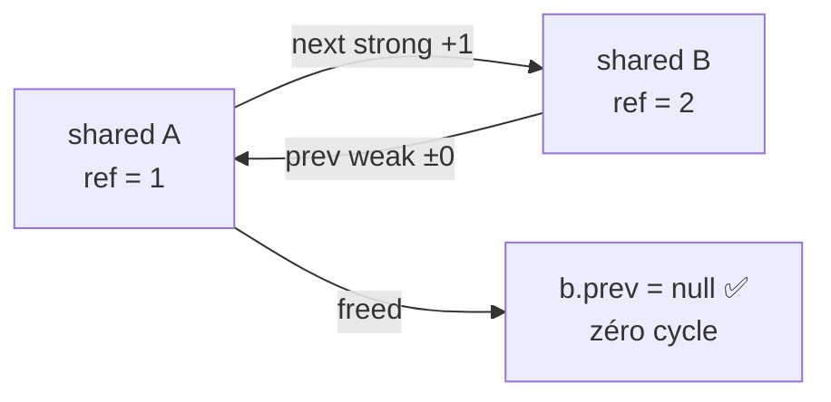

---

## 5. Generics

### 5.1 Règle d'héritage

`T` hérite du lifetime de son conteneur par défaut. `shared` ou `@lifetime` explicite sur `T` override ce comportement.

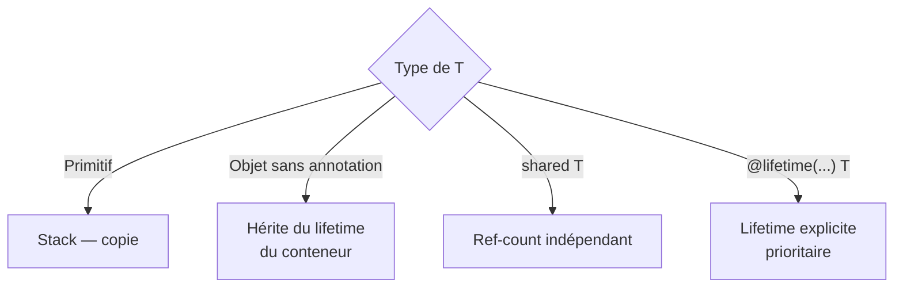

### 5.2 Exemples

```amalgame
// T hérite — freed avec Container
let c1 = Container<Parser>()

// T indépendant — ref-count propre
let c2 = Container<shared User>()

// T explicite — freed à la fin de l'app
let c3 = Container<@lifetime(.app) Config>()

// T s'échappe via return — escape analysis classique
fn getItem<T>(c: Container<T>) -> T {
    return c.item  // T → région appelant
}
```

---

## 6. Unwinding — Defer automatique

En cas d'exception, toutes les régions actives doivent être libérées dans l'ordre inverse de création. `amc` génère un `defer region_free()` pour chaque région à sa création.

```amalgame
fn riskyOp() throws -> Result {
    let a = Parser()        // defer region_free(a) enregistré
    let b = Tokenizer()     // defer region_free(b) enregistré
    let c = dangerousCall() // 💥 exception
    // defers s'exécutent : b freed, puis a freed
}
```

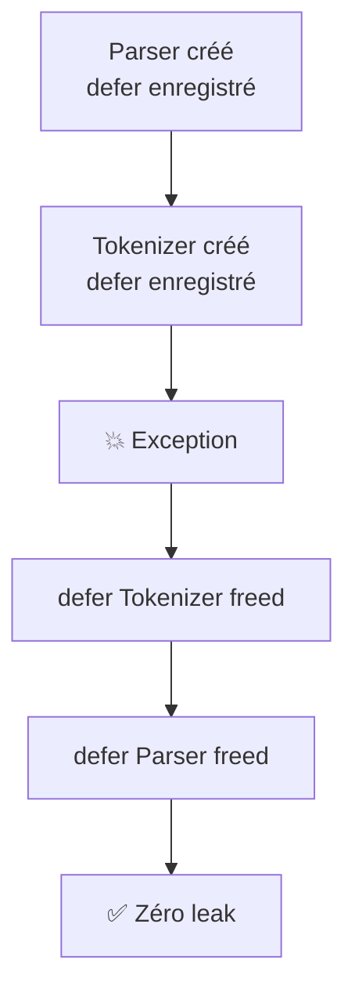

**Le dev ne voit rien** — `amc` génère les defers automatiquement. Aucune annotation requise.

---

## 7. Closures

| Type capturé | Comportement |
|--------------|-------------|
| Primitive (`int`, `float`, `bool`, `char`) | Copie |
| Objet | Move |

```amalgame
let factor = 2
let double = (x: int) => x * factor   // copie

let user = User("Bastien")
let greet = (x: string) => user.greet(x)  // move — user inaccessible après
```

---

## 8. Tableaux

| Déclaration | Allocation |
|-------------|-----------|
| `int[1024]` — taille fixe connue à compile-time | Stack C |
| `int[n]` — taille dynamique | Région courante |

```amalgame
let fixed   = int[1024]  // stack — zéro alloc heap
let dynamic = int[n]     // région courante
```

---

## 9. FFI — Interop C

Tout appel à du code C externe se fait dans une zone `@unsafe`. Le dev assume la responsabilité de la gestion mémoire. AMM ne fait aucune garantie sur les pointeurs C bruts.

```amalgame
@extern("malloc")
fn malloc(size: int) -> ptr

@extern("free")
fn free(p: ptr) -> void

@unsafe {
    let p = malloc(512)   // hors AMM — pas de région, pas de defer
    // ... utilisation ...
    free(p)               // free manuel obligatoire
}
```

**Règles `@unsafe` :**
- Les pointeurs C bruts n'ont pas de lifetime AMM
- Aucune erreur AMM n'est émise dans un bloc `@unsafe`
- Le dev est seul responsable des fuites et double-frees
- Une valeur `@unsafe` ne peut pas sortir du bloc sans conversion explicite

```amalgame
@unsafe {
    let raw = malloc(512)
    let buf = Buffer.fromPtr(raw, 512)  // conversion explicite vers AMM
}
// buf est maintenant une valeur AMM normale
```

---

## 10. Récursion mutuelle

L'escape analysis utilise un marqueur `visiting` pour éviter les boucles infinies sur les fonctions mutuellement récursives. Si une fonction déjà en cours d'analyse est rencontrée, l'analyse suppose `escapes = true` par sécurité.

```amalgame
fn isEven(n: int) -> bool { return isOdd(n - 1) }
fn isOdd(n: int)  -> bool { return isEven(n - 1) }
// escape analysis : isEven → visite isOdd → isEven déjà visiting
// → suppose escapes = true → correct et sûr
```

Ce comportement est transparent pour le dev.

---

## 11. Frontière AMM / GC

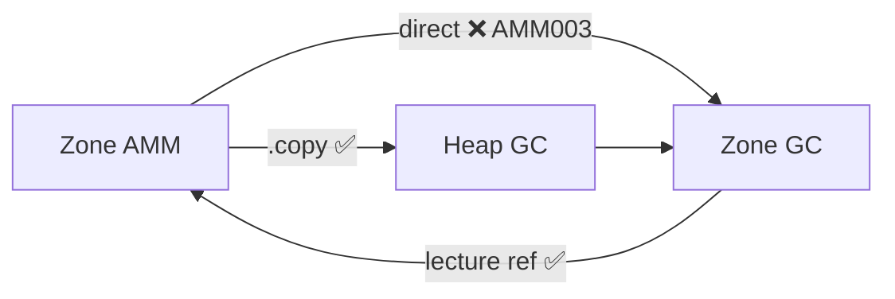

```amalgame
let buf = Buffer.new(512)
gcFunction(buf)         // ❌ ERREUR AMM003
gcFunction(buf.copy())  // ✅ OK
```

---

## 12. Erreurs de compilation AMM

| Code | Message | Cause | Solution |
|------|---------|-------|----------|
| `AMM001` | `value already moved` | Usage après move | Ne plus utiliser après transfert |
| `AMM002` | `cannot share non-shared value` | Double usage | Déclarer `shared` |
| `AMM003` | `AMM value leaked into GC zone` | Passage AMM→GC | Utiliser `.copy()` |
| `AMM004` | `use after free` | Accès après région morte | Vérifier le lifetime |
| `AMM005` | `weak ref must be null-checked` | Usage `weak` sans check | Ajouter `if x != null` |
| `AMM006` | `weak requires shared value` | `weak` sur non-shared | Déclarer `shared` |
| `AMM007` | `lifetime lambda must return bool` | Lambda invalide | Corriger le type |
| `AMM008` | `lifetime lambda must be pure` | Effet de bord | Supprimer les effets de bord |
| `AMM009` | `unsafe value cannot escape unsafe block` | Fuite de ptr C | Utiliser `.fromPtr()` |

---

## 13. Garanties

- ✅ Zéro dangling pointer
- ✅ Zéro double-free
- ✅ Zéro memory leak — y compris en cas d'exception (defer auto) et cycles (weak)
- ✅ Zéro GC pause
- ✅ Zéro annotation obligatoire
- ✅ Zéro dépendance externe
- ✅ Déterminisme total des allocations/libérations
- ✅ Lifetimes sémantiques expressifs via lambda
- ✅ Interop C via `@unsafe` explicite

---

## 14. Sujets reportés

| Sujet | Raison |
|-------|--------|
| Concurrence / async | Nécessite un modèle de tâches complet |
| Interfaces / vtable lifetimes | Dépend de l'implémentation des interfaces dans `amc` |
