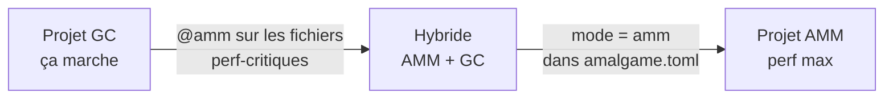

# Gestion mémoire — Guide utilisateur
## AMM et GC en Amalgame v0.5

---

## Philosophie

> **Amalgame est simple par défaut, performant quand tu en as besoin.**

Amalgame propose deux modes de gestion mémoire. Tu n'as pas besoin de choisir tout de suite — le mode par défaut fonctionne pour tout le monde.


| | GC | AMM |
|-|----|----|
| **Pour qui** | Tout le monde | Devs qui veulent perf + sécurité |
| **Annotation** | Aucune | Aucune obligatoire |
| **Pauses** | Possibles | Jamais |
| **Sécurité mémoire** | Runtime | Statique à la compilation |
| **Migration** | — | Progressive, fichier par fichier |

---

## Démarrer — GC par défaut

Rien à configurer. Tu codes, le GC gère.

```amalgame
// Aucune annotation — GC actif par défaut
namespace App

public class Parser {
    public Parser(string src) { ... }
    public List<Token> tokenize() { ... }
}

fn main() {
    let parser = Parser("hello world")
    let tokens = parser.tokenize()
    IO.println(tokens.length)
    // mémoire gérée automatiquement
}
```

---

## Passer à AMM — quand tu es prêt

Quand tu veux plus de performance ou de sécurité statique, tu actives AMM. **Une ligne dans `amalgame.toml`** pour tout le projet, ou **une annotation** par fichier.

### Pour tout le projet

```toml
# amalgame.toml
[memory]
mode = "amm"
```

### Pour un fichier spécifique

```amalgame
@amm
namespace App.Core

// ce fichier utilise AMM
// le reste du projet reste en GC
```

### Migration progressive recommandée



Tu n'as pas à tout migrer d'un coup. Les fichiers `@gc` et `@amm` coexistent dans le même projet.

---

## Ce que AMM t'apporte

### Zéro pause

```amalgame
// GC → pauses imprévisibles sous charge
// AMM → jamais de pause, libération déterministe
@amm
fn processStream(data: Stream) {
    for chunk in data {
        let result = process(chunk)  // ~2ns par itération
        output.write(result)
    }
}
```

### Sécurité statique

```amalgame
// AMM détecte les erreurs à la compilation — pas à runtime
let a = Buffer.new(512)
let b = a
print(a)  // ERREUR AMM001 : value already moved
          // → détecté avant d'exécuter une seule ligne
```

### Lifetimes automatiques

```amalgame
// Dans 90% des cas — rien à écrire, amc infère tout
fn createUser(name: string) -> User {
    let user = User(name)
    return user   // amc sait que user vit chez l'appelant
}

// Pour les cas métier — lifetime déclaratif
@lifetime(.session)
let ctx = UserContext(user)   // freed automatiquement fin de session

// Pour la logique custom — lambda
@lifetime(() => request.isComplete())
let cache = RequestCache()    // freed quand la requête est terminée
```

---

## Tableau comparatif complet

| Critère | GC classique | Vala | Go | Swift | Nim | Zig | Rust | **AMM** |
|---------|:-----------:|:----:|:--:|:-----:|:---:|:---:|:----:|:-------:|
| Pauses GC | ❌ Oui | ✅ Non | ❌ Oui | ✅ Non | ⚠️ Opt. | ✅ Non | ✅ Non | ✅ **Non** |
| Cycles mémoire | ✅ Géré | ❌ Leak | ✅ Géré | ❌ Leak | ⚠️ Opt. | ✅ Manuel | ❌ Leak `Rc` | ✅ **`weak`** |
| Overhead runtime | ❌ Élevé | ⚠️ Moyen | ❌ Élevé | ⚠️ Moyen | ⚠️ Moyen | ✅ Minimal | ✅ Minimal | ✅ **Minimal** |
| Vitesse allocation | ❌ Lente | ⚠️ Moyenne | ❌ Lente | ⚠️ Moyenne | ⚠️ Moyenne | ✅ Rapide | ⚠️ Moyenne | ✅ **Très rapide** |
| Vitesse libération | ❌ Imprévisible | ⚠️ Fréquente | ❌ Imprévisible | ⚠️ Fréquente | ⚠️ Variable | ✅ Manuel | ⚠️ Fréquente | ✅ **En masse** |
| Fragmentation | ❌ Élevée | ⚠️ Moyenne | ❌ Élevée | ⚠️ Moyenne | ⚠️ Moyenne | ✅ Faible | ⚠️ Moyenne | ✅ **Nulle** |
| Sécurité statique | ❌ Aucune | ⚠️ Partielle | ❌ Aucune | ⚠️ Partielle | ⚠️ Partielle | ⚠️ Partielle | ✅ Maximale | ✅ **Forte** |
| Lifetimes sémantiques | ❌ | ❌ | ❌ | ❌ | ❌ | ⚠️ Manuel | ⚠️ Verbeux | ✅ **Inférés + lambda** |
| Unwinding sûr | ✅ | ⚠️ | ✅ | ✅ | ⚠️ | ⚠️ Manuel | ✅ | ✅ **Defer auto** |
| Dépendance externe | ❌ Runtime | ❌ GLib | ❌ Runtime | ⚠️ stdlib | ⚠️ Opt. | ✅ Aucune | ✅ Aucune | ✅ **Aucune** |
| Ergonomie dev | ✅ Max | ✅ Bonne | ✅ Bonne | ✅ Bonne | ✅ Bonne | ⚠️ Moyenne | ❌ Difficile | ✅ **Bonne** |
| Courbe apprentissage | ✅ Faible | ✅ Faible | ✅ Faible | ✅ Faible | ✅ Faible | ⚠️ Moyenne | ❌ Élevée | ✅ **Faible** |
| Compile vers C | ❌ | ✅ | ❌ | ❌ | ✅ | ❌ | ❌ | ✅ |

---

## Référence AMM

### Ownership

```amalgame
let a = Buffer.new(512)
let b = a               // move — a inaccessible
print(b)                // ✅

let user = shared User("Bastien")
cache.store(user)       // ref-count +1
session.attach(user)    // ref-count +1

let a = shared Node()
let b = shared Node()
a.next = b
b.prev = weak a         // pas de cycle
if b.prev != null { b.prev.doSomething() }
```

### Tableaux

```amalgame
let fixed   = int[1024]  // taille fixe → stack
let dynamic = int[n]     // taille dynamique → région courante
```

### Generics

```amalgame
let c1 = Container<Parser>()              // T hérite du lifetime du conteneur
let c2 = Container<shared User>()         // T ref-count indépendant
let c3 = Container<@lifetime(.app) Config>() // T lifetime explicite
```

### FFI

```amalgame
@extern("malloc") fn malloc(size: int) -> ptr
@extern("free")   fn free(p: ptr) -> void

@unsafe {
    let raw = malloc(512)
    let buf = Buffer.fromPtr(raw, 512)  // conversion vers AMM
}
```

### Frontière AMM ↔ GC

```amalgame
let buf = Buffer.new(512)
gcFunction(buf)         // ❌ AMM003
gcFunction(buf.copy())  // ✅
```

---

## Erreurs de compilation AMM

| Code | Message | Solution |
|------|---------|----------|
| `AMM001` | `value already moved` | Ne plus utiliser après move |
| `AMM002` | `cannot share non-shared value` | Déclarer `shared` |
| `AMM003` | `AMM value leaked into GC zone` | Utiliser `.copy()` |
| `AMM004` | `use after free` | Vérifier le lifetime |
| `AMM005` | `weak ref must be null-checked` | Ajouter `if x != null` |
| `AMM006` | `weak requires shared value` | Déclarer `shared` |
| `AMM007` | `lifetime lambda must return bool` | Corriger le type |
| `AMM008` | `lifetime lambda must be pure` | Supprimer les effets de bord |
| `AMM009` | `unsafe value cannot escape unsafe block` | Utiliser `.fromPtr()` |
